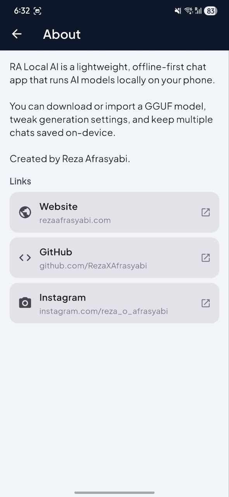

# RALocalAi

Offline-first **local LLM chat** for Android built with Flutter. Run **GGUF** models fully on-device via **llama.cpp** (through `flutter_llama`) with streaming responses, model download/import, and persisted chat history.

## Why this exists

This repository demonstrates a production-minded Flutter application that:
- Ships a **clean, testable architecture** (Riverpod state management + service boundaries)
- Provides a strong **mobile UX** for large-file workflows (GGUF import/copy, progress, timeouts)
- Keeps user data **on-device by design** (no cloud chat history; no server inference)

## Key features

- **Local inference**: load a `.gguf` file and chat with token streaming (with a safe blocking fallback).
- **Model acquisition**:
  - Use an external GGUF file path when possible
  - Import/copy a model into app documents storage when needed
  - Download curated models from `assets/ai_list.json` into a shared folder (`RA_LocalAiChat`)
- **Generation controls**: context size, temperature, top‑p, top‑k, max tokens, repeat penalty.
- **Prompt templates**: automatic model-family prompt formatting (Llama 3, ChatML, Alpaca, Vicuna, Gemma) with manual override.
- **Multi-chat history**: create/switch/delete chats; titles auto-derived from the first user message.
- **Onboarding + tutorial**: first-run pages and optional coach-marks overlay.
- **In-app terminal**: captures app logs and `debugPrint` output for transparent debugging.

## App preview

| Screen | Preview |
|---|---|
| **Chat + drawer navigation** |  |

| Onboarding | Onboarding | Onboarding |
|---|---|---|
|  |  |  |
|  |  |  |

| Models | Diagnostics | Settings |
|---|---|---|
|  |  |  |

| Extra | Extra |
|---|---|
|  |  |

## Technical challenges

- **Large-file reliability (GGUF)**: safely handling `content://` URIs and temporary picker cache paths by streaming/copying models into an app-controlled directory when needed, while keeping the UI responsive.
- **Android storage permissions**: supporting modern Android storage rules and guiding users through “All files access” flows when downloading multi‑GB models to shared storage.
- **Streaming generation UX**: token streaming with a robust fallback to blocking generation to avoid platform/event-channel edge cases.
- **Prompt format correctness**: selecting the right chat template per model family (auto‑inferred from file name, with a user override) to keep outputs aligned with training formats.
- **State & persistence**: predictable local persistence of chat history, last-loaded model path, and generation settings while keeping data on-device by default.

## Tech stack

- **Flutter / Dart**
- **State management**: Riverpod (`flutter_riverpod`)
- **Local LLM runtime**: [`flutter_llama`](https://pub.dev/packages/flutter_llama) (llama.cpp wrapper)
- **Storage / permissions**: `path_provider`, `permission_handler`
- **UX**: Material 3, Google Fonts

## Project structure

```text
lib/
  main.dart                     # Entry point + guarded zone + log capture
  app/my_app.dart               # MaterialApp + themes + initial routing
  screens/
    initial_screen.dart         # Onboarding vs ChatScreen
    chat_screen.dart            # Main UI, model flows, drawer navigation
    terminal_screen.dart        # In-app log viewer
  services/
    local_ai_service.dart        # Inference boundary (flutter_llama wrapper)
    app_log_service.dart         # Central in-memory logging
    device_ram_service.dart      # Android RAM query via platform channel
    storage_permission_service.dart
    native_runtime_service.dart  # Deprecated stubs (kept for compatibility)
  providers/
    chat_provider.dart
    chat_history_provider.dart
    model_list_provider.dart
    model_download_provider.dart
    downloaded_models_provider.dart
    generation_settings_provider.dart
    theme_provider.dart
    app_providers.dart
  models/
    chat.dart
    chat_message.dart
    ai_model_list_item.dart
  utils/
    ai_formatter.dart            # Prompt templates + model-family inference
    device_info.dart             # Drawer diagnostics via platform channel
  widgets/
    chat_bubble.dart
    typing_indicator_bubble.dart
    empty_state.dart
    error_banner.dart
    coach_marks_overlay.dart
assets/
  ai_list.json
  icon_launcher.png
```

## Run locally

### Prerequisites

- Flutter SDK installed (`flutter doctor` should be clean)
- Android SDK / Android Studio, or an Android device with USB debugging

### Install dependencies

```bash
flutter pub get
```

### Run on Android

```bash
flutter run
```

## Using GGUF models

- **File picker**: choose a `.gguf` model from device storage.
- **Import vs external path**:
  - **External**: the app uses the selected file path directly when it’s reliable.
  - **Import**: if the path is a `content://` URI, in a temporary cache, or otherwise unreliable, the app streams and copies the file into the app documents directory for stable loading.
- **Downloads folder**: downloaded models are stored in:
  - Android: `/storage/emulated/0/RA_LocalAiChat`

> Models can be very large. On Android, the app may request “All files access” depending on OS version and storage APIs.

## Privacy & data handling

- **Chat history**: stored locally on device (SharedPreferences JSON).  
- **Inference**: performed locally through the native runtime; no server inference layer is included here.
- **Network access**: used only for model downloads (URLs listed in `assets/ai_list.json`).

## Author

Reza Afrasyabi — `rezaafrasyabi.com`

## License

This project is licensed under the GNU GPLv3 License - see the LICENSE file for details.
Copyright © 2026 Reza Afrasyabi.
