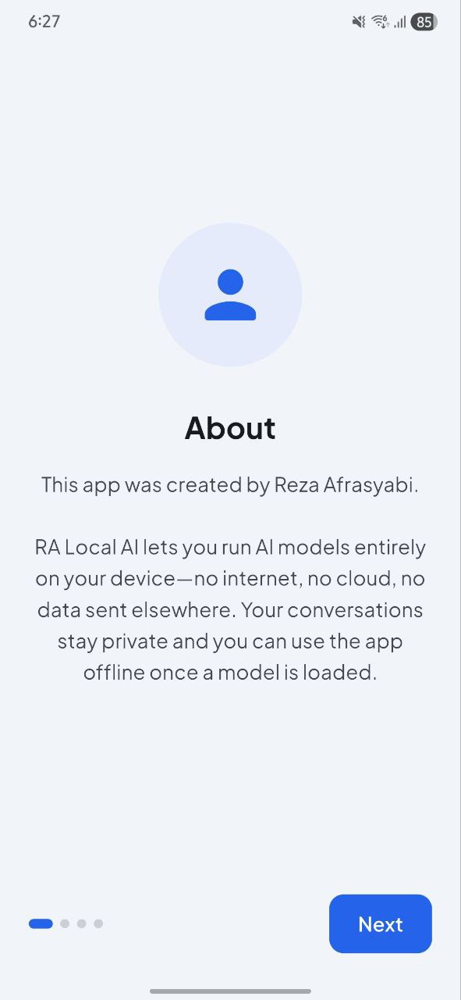
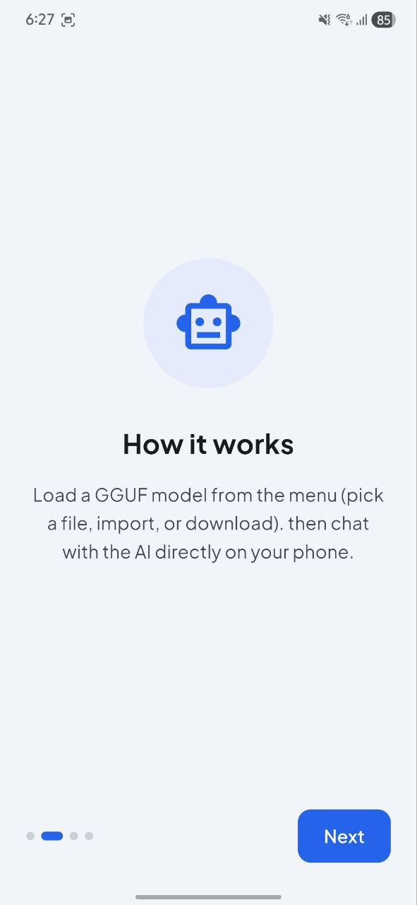
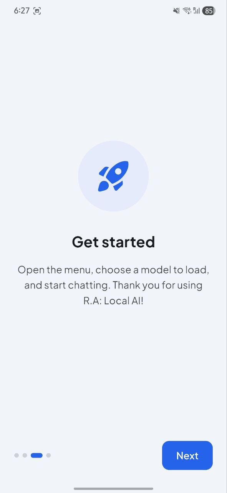
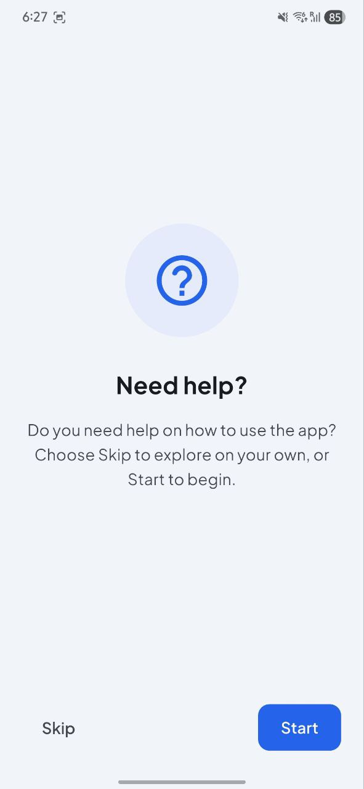
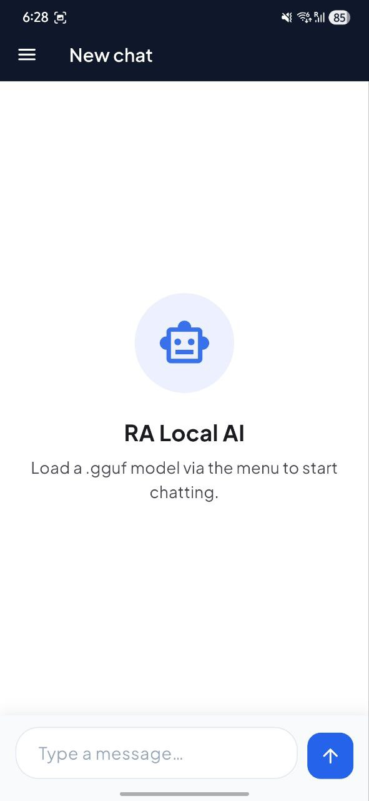
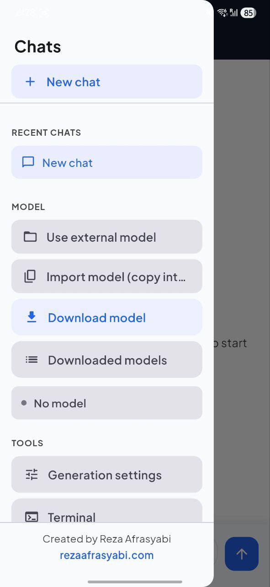
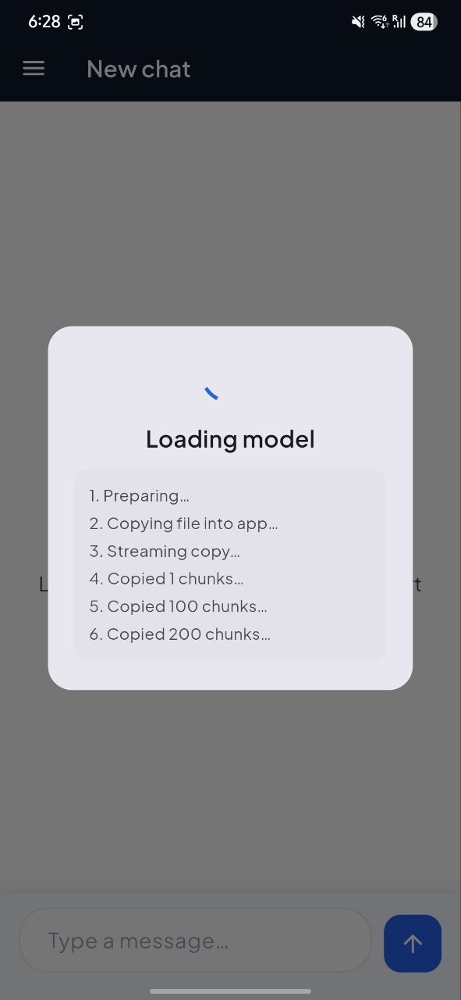
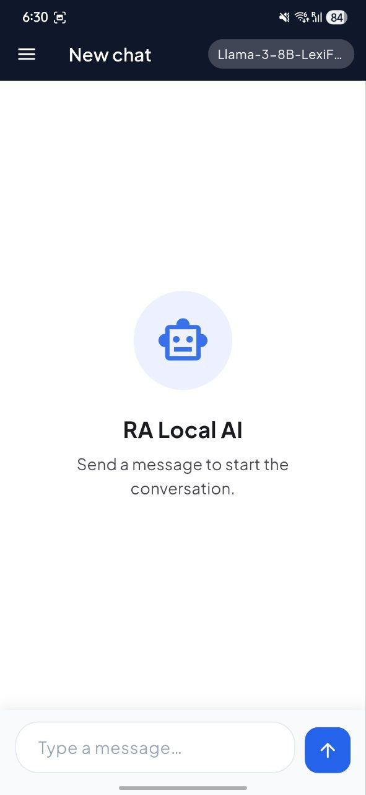
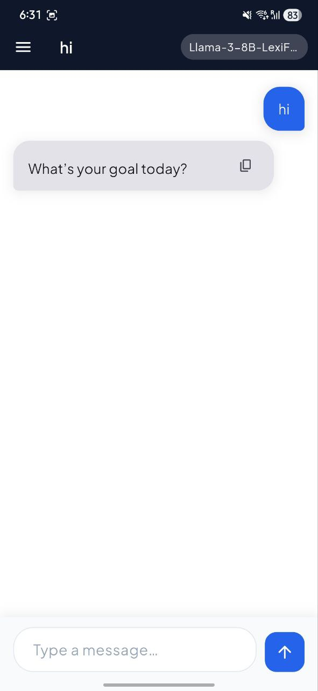
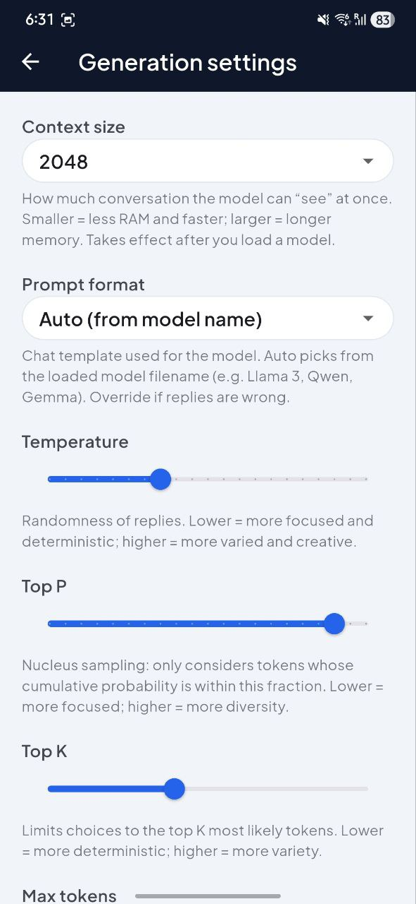

# RA Local AI (Android)

A Flutter-based **Android** app for running AI language models locally on your phone. Chat with GGUF models entirely on-device—no internet, no cloud, no data sent elsewhere.

---

## Overview

- **App name:** RA Local AI  
- **Package:** `com.rezaafrasyabi.ralocalai`  
- **Platform:** Android only (minSdk 24, arm64-v8a)  
- **Stack:** Flutter (Dart), flutter_llama (llama.cpp), Riverpod  

---

## Features

- **Load models:** Pick a `.gguf` file from device, import into app storage, or use previously saved models.
- **Download models:** In-app list of models (from `assets/ai_list.json`) with RAM compatibility and download progress; downloads go to `RA_LocalAiChat` on external storage.
- **Chat:** Send messages and get streamed or non-streamed replies from the loaded model.
- **Prompt formats:** Automatic template selection by model name (Llama 3, ChatML, Alpaca, Vicuna, Gemma), with optional override in Generation settings.
- **Generation settings:** Context size, temperature, top-p, top-k, max tokens, repeat penalty; all persisted.
- **Chat history:** Multiple chats with titles; switch or delete from the drawer.
- **Onboarding:** First-launch intro (About, How it works, Get started, Need help?) with **Skip** / **Start**; **Start** shows coach marks (spotlight + tooltips) on the chat screen.
- **Drawer:** New chat, recent chats, model actions (external/import/download/downloaded), saved models, generation settings, terminal, dark mode, about, device info.
- **Terminal:** In-app log viewer for debug output.
- **Release build:** Signed APK with ProGuard minify/shrink and optional Dart obfuscation (`flutter build apk --release --obfuscate`).

---

## Screenshots

Screenshots are in `images/`. Order follows the typical user flow.

| # | Screenshot | Description |
|---|------------|-------------|
| 1 |  | **Onboarding – About** – First launch intro: app by Reza Afrasyabi, local AI and privacy. |
| 2 |  | **Onboarding – How it works** – Load a GGUF model from the menu, then chat on-device. |
| 3 |  | **Onboarding – Get started** – Open menu, choose a model, start chatting. |
| 4 |  | **Onboarding – Need help?** – Skip or Start; Start shows the in-app coach marks tutorial. |
| 5 |  | **Chat – Empty state** – Main chat screen before a model is loaded or when there are no messages. |
| 6 |  | **Drawer – Menu** – New chat, recent chats, model (load/import/download), saved models, settings, terminal, dark mode, about, device info. |
| 7 |  | **Chat – Conversation** – User message and AI reply; model runs locally with streaming |
| 8 |  | **Download model** – List of models with RAM info; tap to download to RA_LocalAiChat. |
| 9 |  | **Generation settings** – Context size, prompt format, temperature, top-p, top-k, max tokens, repeat penalty. |
| 10 |  | **Terminal** – In-app log viewer for debug and generation output. |

---

## Project structure (relevant to Android)

```
lib/
  main.dart                 # Entry; ProviderScope, MyApp, logging
  app/my_app.dart          # MaterialApp, theme, InitialScreen
  screens/
    initial_screen.dart     # Onboarding vs ChatScreen; optional coach marks
    chat_screen.dart        # Main chat UI, drawer, model list, tutorial overlay
    generation_settings_screen.dart
    terminal_screen.dart
  services/
    local_ai_service.dart   # FlutterLlama wrapper, loadModel, sendPrompt[Stream], prompt building
    device_ram_service.dart
    storage_permission_service.dart
    app_log_service.dart
  providers/
    chat_provider.dart
    chat_history_provider.dart
    model_list_provider.dart
    generation_settings_provider.dart  # Includes promptFormat (ModelType?)
    model_download_provider.dart
  utils/
    ai_formatter.dart       # ModelType enum, AIFormatter.buildPrompt, inferFromModelName
    device_info.dart
  widgets/
    coach_marks_overlay.dart
    chat_bubble.dart
    empty_state.dart
    error_banner.dart
```

---

## Author

Reza Afrasyabi – [rezaafrasyabi.com](https://rezaafrasyabi.com)

---

*This document describes the Android version of the project for GitHub.*
"# RALocalAi" 
"# RALocalAi" 
